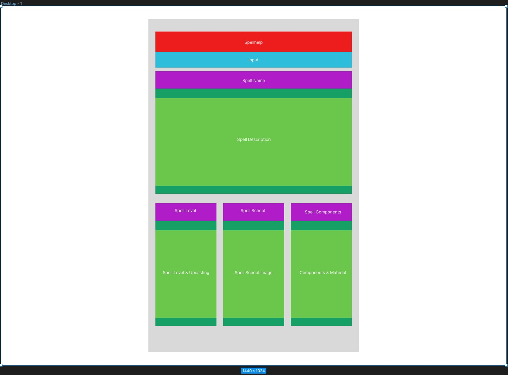
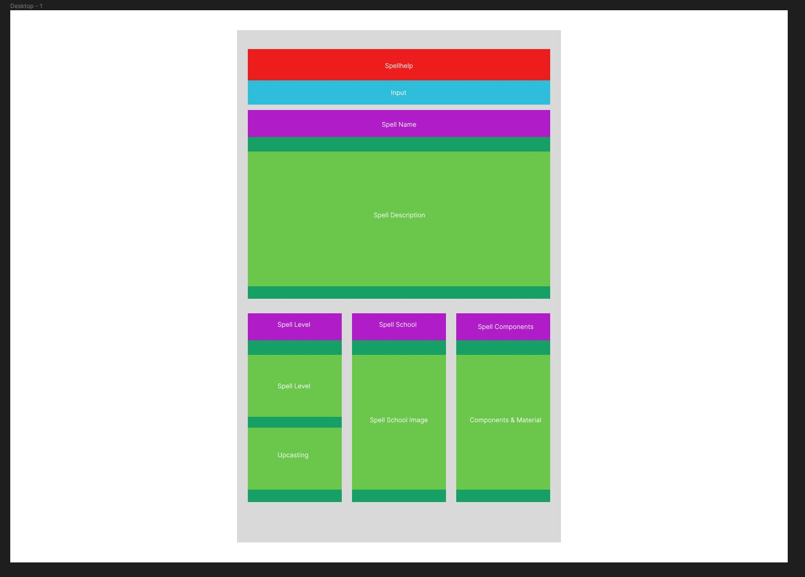
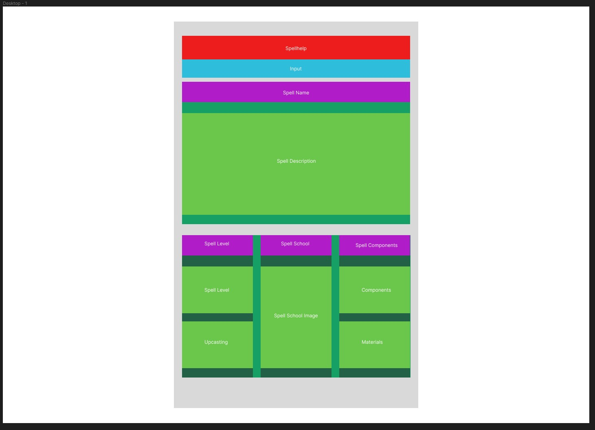

# SpellHelp Web App

SpellHelp is a web app that provides users with descriptions of the many different spells of Dungeons and Dragons 5th Edition. The app utilizes the DnD API provided at https://www.dnd5eapi.co/ to gather up to date data on the numerous spells in 5th Edition. 

**Technical Description**

By utilizing the $.ajax command, attempt to modify the called URL with the input from a form in the HTML. After receiving the .json file from the database, display the relevant information to the user in a text format.
## **Features:**

|Feature|Description|
| :-----: | :-----: |
|Description|Users will be able to view a description of the spell they have searched for.|
|School|Users will be able to view the school of magic that the spell is classified under.|
|Level|Users will be able to view the level of the spell.|
|Components and Materials|Users will be able to view the Verbal, Somatic, and Material components of the spell.|

*_*Wireframes*_*
https://www.figma.com/file/73J8Os8gcn3VXOAcFFzo0G/Untitled?type=design&node-id=0%3A1&t=idCesMrQashBf6dt-1

*_*Sources*_*
Used the Schools of Magic from https://dribbble.com/shots/3836841-DnD-Schools-of-Magic#shot-description as images
Used the D20 from https://thenounproject.com/browse/icons/term/dnd/ as the icon

## *_*Beyond the MVP*_*
On the branch *dropdownMenuTesting*, the following features were added for testing

|Feature|Description|
| :-----: | :-----: |
|Class|In the dropdown menu, users will be able to select *Classes* then search for one of the following: barbarian, bard, cleric, druid, fighter, monk, paladin, ranger, rogue, sorcerer, warlock, & wizard.|
|Skills|Users will be able to view a description of the class they have searched for.|
|Saving Throws|Users will be able to see what Saving Throws the class they searched for has proficiency in.|
|Hit Dice|Users will be able to see which Hit Dice the class they searched for uses.|
|Proficiencies|Users will be able to see what weapon and armor proficiencies the class they searched for has. |
|-|-|
|Race|In the dropdown menu, users will be able to select *Races* then search for one of the following: dragonborn, dwarf, elf, gnome, half-elf, half-orc, halfling, human, & tiefling.|
|Traits|Users will be able to view the Traits of the race they have selected.|
|Languages|Users will be able to view what Languages the race they have selected natively has.|
|Default Alignment|Users will be able to view a description of the selected race's Default Alignment.|
|Size|Users will be able to view a description of their race's weight and height, as well as the in-game size statistic.|
